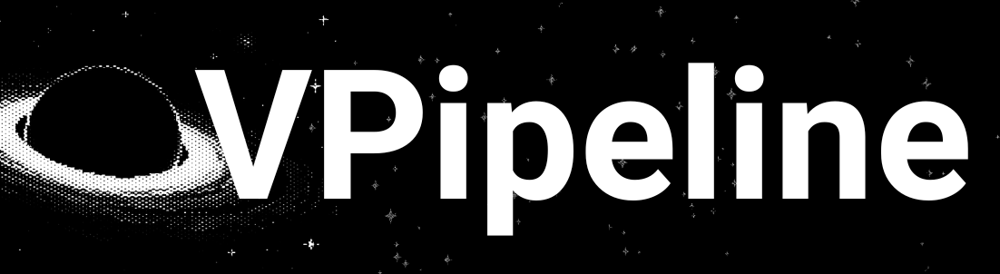
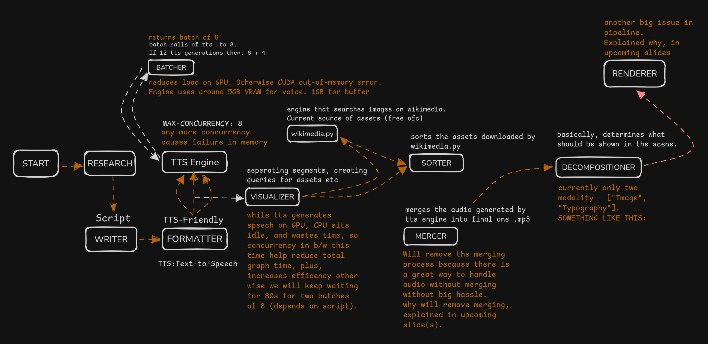

[](https://mistral.ai/)
[](https://www.python.otg)
[](https://langchain.com/langgraph)

> [!IMPORTANT]
> Only built for linux. Windows and macOS optimization will come soon.

VPipeline is an AI-powered video creation pipeline that transforms a single topic into a fully narrated documentary workflow. The current implementation generates formatted narration and high-quality audio, with the long-term goal of producing complete cinematic videos automatically. 

> [!NOTE] 
> **Current Status:** VPipeline generates narrated audio (`.wav`). 
> 
> **Final Goal:** Generate complete, fully automated `.mp4` documentary videos with narration, visuals, animations, typography, maps, and procedural graphics. 

---
## Vision
Traditional video creation requires researching, writing, recording, editing, sourcing visuals, synchronizing narration, and rendering everything together. 

Pipeline aims to automate that entire workflow through specialized AI agents.

---

## ToDo

> Yes, I use this for my daily todo.

<code> Completed TODOs <a href="https://github.com/DevankSinghChaudhary/VPipeline/blob/main/COMPLETED.md">COMPLETED.md</a></code>

**19 Sept**
- [x] Plan the renderer structure for tomorrow's work
  - Save @ `/documents/structure.txt`

---
## Planned Features 

- AI-generated visuals (Not SLOP)
- Dynamic typography 
- Animated diagrams 
- Geographic maps 
- Timeline animation
- Procedural graphics 
- Automatic video editing 
- MP4 rendering 

> [!IMPORTANT]
> Already reached till `.mp4` in [previous version](https://github.com/DevankSinghChaudhary/video-creation-pipeline/).

## Structure of VPipeline

  

## Project Status 
VPipeline is under active development. 

The audio generation pipeline is operational. Visual generation, animation, and final video rendering are currently being developed. 

---
## Requirements

|Hardware     | Minimum VRAM  | Recommended VRAM |
|-------------|:-------------:|:----------------:|
|GPU          |     6GB       |       8GB        |

*NVIDIA is preferred*
*Example: RTX 3050*

> [!NOTE]
> As VRAM will be used for tts and stt models.


## Clone & Run

### 1. Clone the repository:

```bash
git clone https://github.com/DevankSinghChaudhary/VPipeline.git
cd VPipeline
```

---

### 2. Install necessary requirements

```bash
uv sync
```

> [!NOTE]
> To install uv, refer to this [doc](https://docs.astral.sh/uv/getting-started/installation/)

### 3. Run the pipeline

```bash
cd VPipeline/src/vcp  
uv run main.py
```


## License 

[MIT](https://github.com/DevankSinghChaudhary/VPipeline/tree/main?tab=MIT-1-ov-file)
