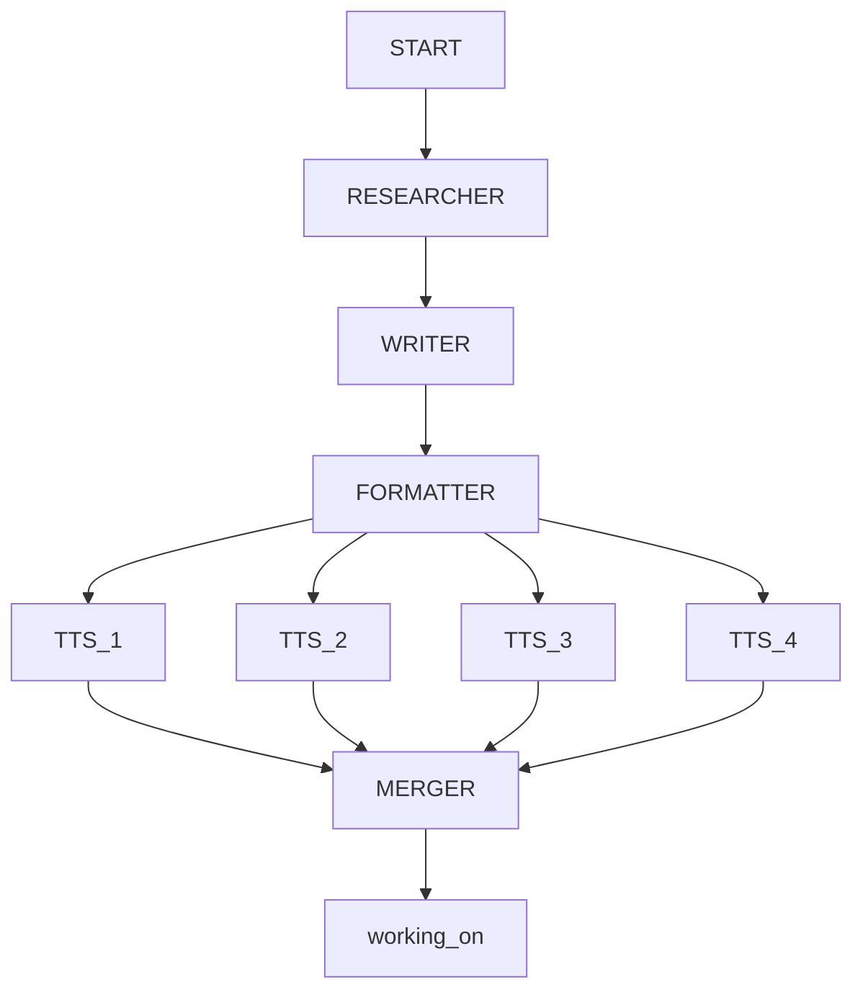

# VPipeline
> AI-Powered video creation pipeline

[](https://mistral.ai/)

---
Working of VPipeline:

```mermaid
graph TD;
    START-->RESEARCHER;
    RESEARCHER-->WRITER;
    WRITER-->FORMATTER;
    FORMATTER-->TTS_1;
    FORMATTER-->TTS_2;
    FORMATTER-->TTS_3;
    FORMATTER-->TTS_4;
    TTS_1-->MERGER;
    TTS_2-->MERGER;
    TTS_3-->MERGER;
    TTS_4-->MERGER;
    MERGER-->working_on
```
```


## Stack
- Python
- Langchain
- Langgraph
- Kokoro
